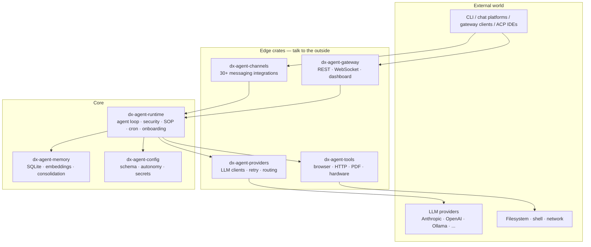
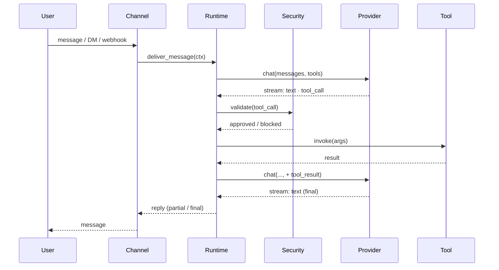

# Architecture Overview

DX Agent is a layered Rust workspace. At the top is the agent runtime; below it are pluggable providers, channels, tools, and memory; supporting crates handle config, sandboxing, and hardware.

## High-level shape

## Crates in scope

| Crate | Role |
|---|---|
| `dx-agent-runtime` | Agent loop, security policy enforcement, SOP engine, cron scheduler, onboarding sections, RPC layer for zerocode |
| `dx-agent-config` | TOML schema, secrets encryption, autonomy levels, workspace resolution |
| `dx-agent-api` | Public traits — `Provider`, `Channel`, `Tool`. The kernel ABI |
| `dx-agent-providers` | All LLM client impls (Anthropic, OpenAI, Ollama, …) plus the hint-based router and same-provider retry wrapper |
| `dx-agent-channels` | 30+ messaging integrations (Discord, Slack, Telegram, Matrix, email, voice, …) |
| `dx-agent-gateway` | HTTP / WebSocket gateway, web dashboard, webhook ingress |
| `dx-agent-tools` | Callable tool implementations the agent invokes (browser, HTTP, PDF, hardware probes) |
| `dx-agent-tool-call-parser` | Model-side tool-call syntax parsing and normalisation |
| `dx-agent-memory` | Conversation memory, embeddings, vector retrieval |
| `dx-agent-plugins` | Dynamic plugin loading |
| `dx-agent-hardware` | Hardware abstraction layer (GPIO, I2C, SPI, USB) |
| `dx-agent-infra` | Tracing, metrics, structured logging |
| `dx-agent-macros` | Derive macros for config, tool registration |
| `zerocode` | Terminal UI |
| `aardvark-sys`, `robot-kit` | Specialised hardware support |

The microkernel roadmap (RFC #5574) is actively splitting `dx-agent-runtime` further — the kernel layer will shrink to the agent loop and policy enforcement, with everything else moving behind feature flags.

## Request lifecycle (short)

Full detail: [Request lifecycle](./request-lifecycle.md).

## Extension points

Three trait-based extension points live in `dx-agent-api`:

- **`Provider`** — implement for a new LLM endpoint. See [Custom providers](../providers/custom.md).
- **`Channel`** — implement for a new messaging platform. Inbound and outbound are separate hooks.
- **`Tool`** — implement for a new capability the agent can invoke. See [Developing → Plugin protocol](../developing/plugin-protocol.md).

All three are registered at startup via factory functions; the kernel doesn't know the concrete types. Compile-time feature flags decide which implementations ship in a given binary.

## Where to read next

- [Crates](./crates.md) — per-crate deep dive
- [Request lifecycle](./request-lifecycle.md) — streaming, tool calls, approvals
- [Model Providers → Overview](../providers/overview.md)
- [Security → Overview](../security/overview.md)
